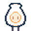

#  **Hey there. I'm AbnerSquared.**
In my free time, I like to draw and work on music, with the occasional programming indulgence.
I taught myself a fair amount of C# programming from Orikivo, a Discord bot with an assorted variety of random ideas that came to fruition.

> **Web Portal**

[**Game Jams**](https://abnersquared.itch.io/): This is where my contributions and creations of small games will appear.

[**Portfolio**](https://abnersquared.github.io/Portfolio/): It's a bit rough right now, but this is where my art and projects will be noted. 

[**Instagram**](https://www.instagram.com/abnersquared/): Yeah, I pretty much just chill here now. 

[**Orikivo's Website**](https://abnersquared.github.io/Orikivo.Web/): A relic of an ancient time. 

[**Invite to Orikivo Arcade**](https://abnersquared.github.io/Orikivo.Web/invites/arcadia): This links you to the invite page for Orikivo Arcade. 

## What's next for Orikivo?
I'm not sure if Orikivo is going to stick around for too much longer.
I learned a lot from that project, but it ended up being too complex for people to use (which is understandable, nobody would want to read that much).

If Orikivo is going to stick around, a **lot** of features and mechanics would have to be removed (which hurts me, but I'm sure it'd be for the better).
Since Discord Games Lab is now a thing, it makes it a bit more pointless to keep working on this bot.
We'll see when the time comes, but I wouldn't count on it.

## Metrics

  

